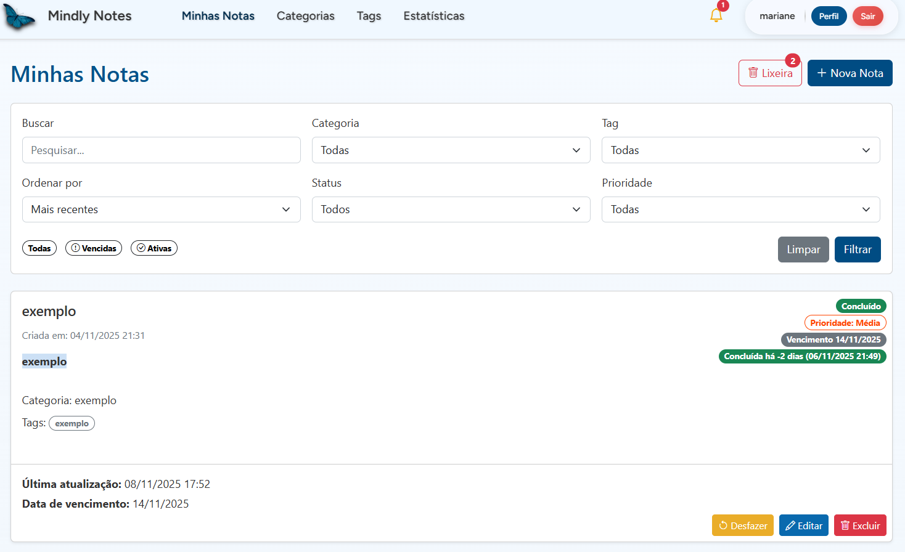
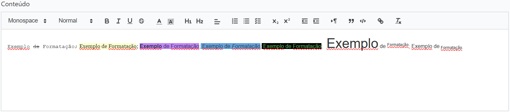
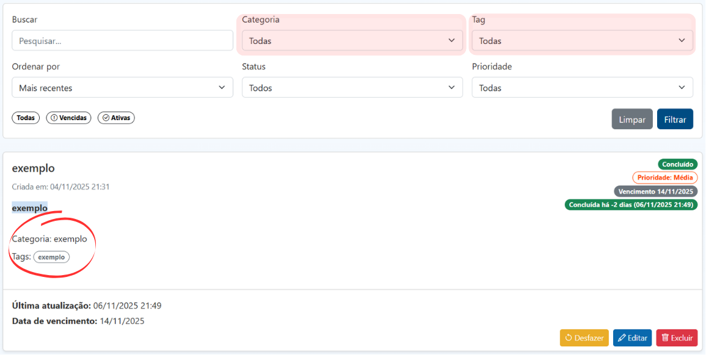
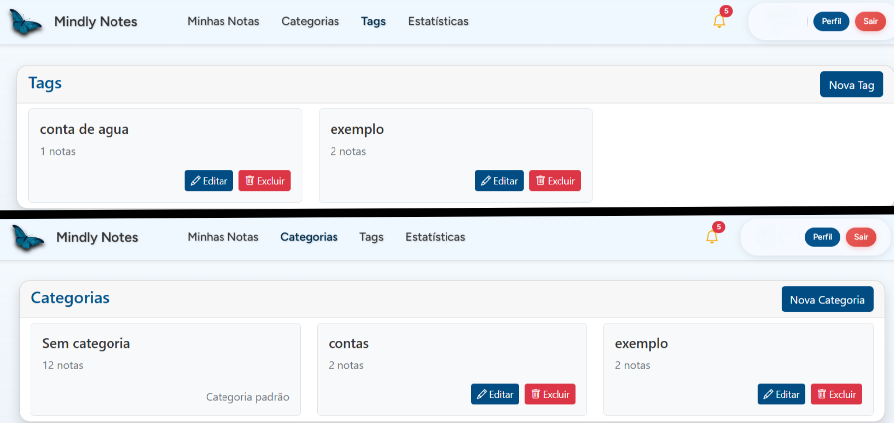
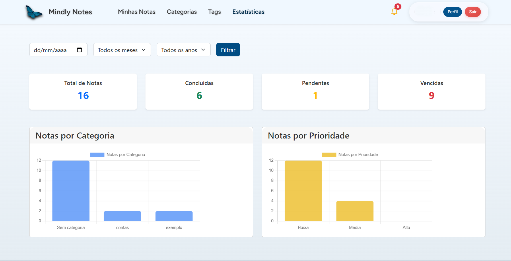
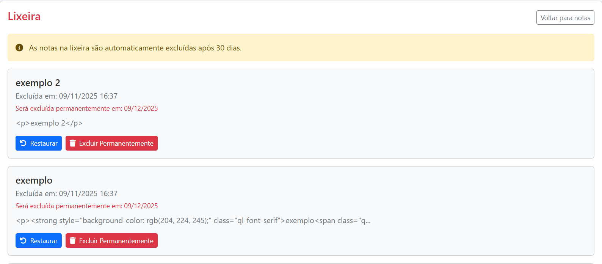
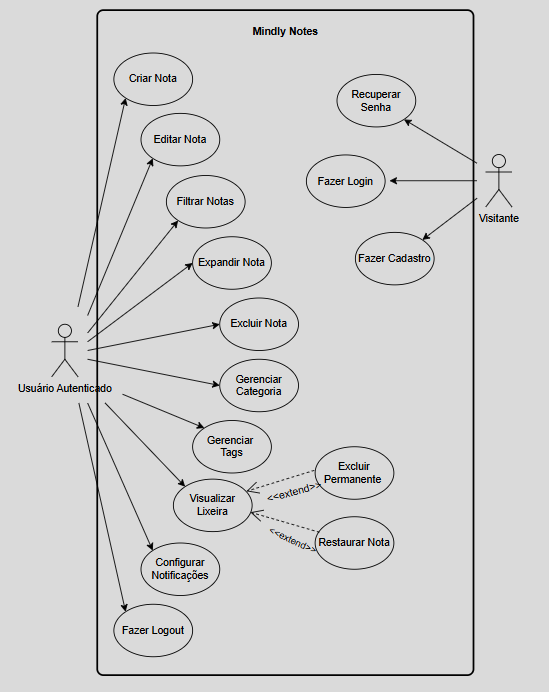
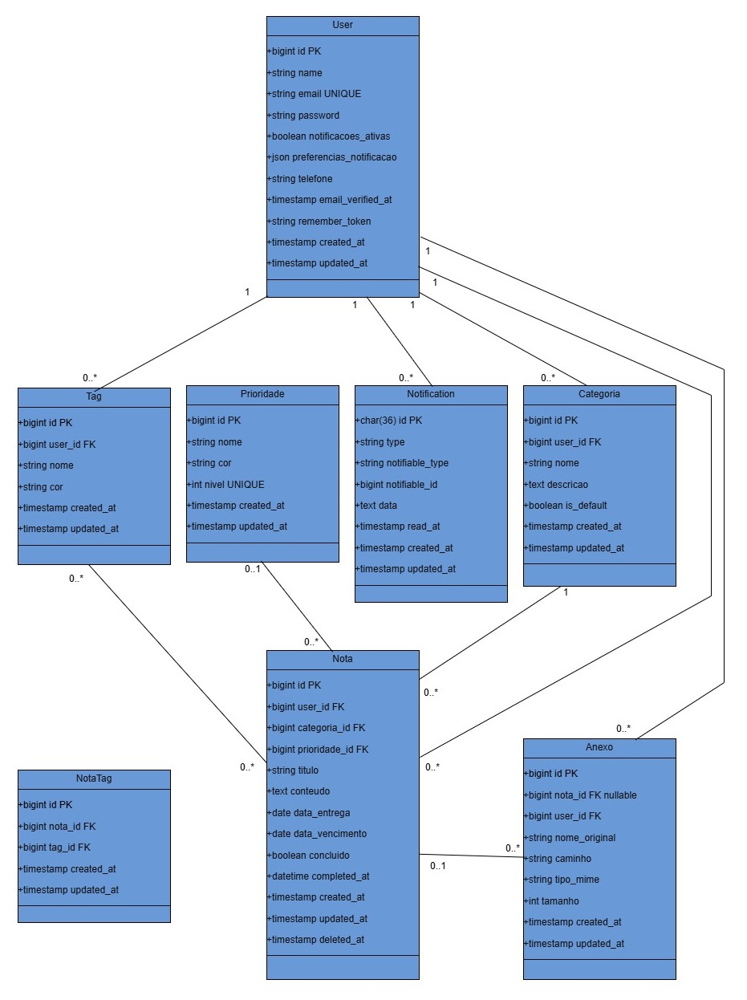

# 📝 Mindly Notes

Sistema web de gerenciamento de notas desenvolvido como Trabalho de Conclusão de Curso, utilizando Laravel como framework principal.

---

## 🎯 Objetivo do Projeto

O **Mindly Notes** tem como objetivo facilitar a organização pessoal e acadêmica dos usuários, permitindo criar, editar, classificar e gerenciar anotações de forma prática, visual e acessível. A plataforma se torna um ambiente ideal para armazenar informações importantes, com notificações ajustáveis de acordo com a preferência do usuário para não perder prazos. Além disso, o usuário pode economizar armazenamento do celular/computador e manter tudo organizado em um único lugar.

**Exemplo de uso prático:** Criar uma nota dentro da categoria "Contas" com a tag "Conta de água", organizar mensalmente com data de vencimento usando checklist do editor de texto, receber notificações sobre os prazos, anexar comprovantes de pagamento e marcar como pago após a quitação."

## 🚀 Funcionalidades Principais

- 🔐 Sistema de autenticação de usuários (Laravel Breeze)
- 📝 Criar, editar e excluir notas com soft delete
- ✍️ Editor de texto rico com formatação - **Quill.js** 
- 📎 Upload de arquivos via drag and drop - **Dropzone.js**
- 🏷️ Organização por categorias e tags
- 🎯 Sistema de prioridades (Baixa, Média, Alta)
- 📊 Dashboard com estatísticas
- 📈 Gráficos interativos - **Chart.js**
- 🔍 Busca e filtros avançados
- 🔔 Notificações por email
- 🗑️ Lixeira com recuperação e exclusão permanente em 30 dias
- 💾 Armazenamento seguro de dados
- 📱 Interface responsiva - **Bootstrap 5**
- 🎨 Design intuitivo e moderno

---
## 📸 Screenshots
**Tela das notas**

**Conteúdo**

**Categoria e Tags**


**Estatísticas**

**Lixeira**

**Notificacoes**


---

## 🛠️ Tecnologias Utilizadas

## Backend
- Framework: Laravel (usei a versão 11.30.0)
- Banco de dados: MySQL
- Autenticação: Breeze
- Gerenciador de Dependências: Composer
- Versionamento de código
- Git/GitHub (Versionamento de código)
- Domínio: mindlynotes.com.br

## Frontend 
- Templates: Blade
- Marcação: HTML5, CSS3
- front-end framework: Bootstrap 5
- Gerenciador de Dependências: NPM

## Bibliotecas JavaScript
- Quill.js - Editor de texto rico (WYSIWYG) para criação e edição de notas com formatação
- Dropzone.js - Upload de arquivos com drag and drop
- Chart.js - Gráficos interativos para estatísticas

---

# 📋 Levantamento de Requisitos - Mindly Notes

### 1. Definições e Siglas
- **RF:** Requisito Funcional
- **RNF:** Requisito Não Funcional

---

## ⚙️ 2. Requisitos Funcionais

### 2.1 Módulo de Autenticação

| ID | Requisito | Prioridade | Descrição |
|----|-----------|------------|-----------|
| RF01 | Cadastro de usuário | Alta | O sistema deve permitir que novos usuários se cadastrem informando nome, email e senha |
| RF02 | Login de usuário | Alta | O sistema deve permitir que usuários cadastrados façam login com email e senha |
| RF03 | Logout de usuário | Alta | O sistema deve permitir que o usuário encerre sua sessão |
| RF04 | Recuperação de senha | Média | O sistema deve permitir que o usuário recupere sua senha via email |
| RF05 | Validação de email | Média | O sistema deve validar o formato do email no cadastro |
| RF06 | Criptografia de senha | Alta | O sistema deve armazenar senhas de forma criptografada |

### 2.2 Módulo de Notas

| ID | Requisito | Prioridade | Descrição |
|----|-----------|------------|-----------|
| RF07 | Criar nota | Alta | O sistema deve permitir que o usuário crie novas notas |
| RF08 | Editar nota | Alta | O sistema deve permitir que o usuário edite notas existentes |
| RF09 | Excluir nota | Alta | O sistema deve permitir que o usuário exclua notas (soft delete) |
| RF10 | Visualizar nota | Alta | O sistema deve permitir expandir a nota para visualizar seu conteúdo completo |
| RF11 | Listar notas | Alta | O sistema deve exibir uma lista com todas as notas do usuário |
| RF12 | Editor de texto rico | Alta | O sistema deve fornecer um editor com formatação (negrito, itálico, listas, títulos) |
| RF13 | Definir título da nota | Alta | O sistema deve permitir que cada nota tenha um título |
| RF14 | Adicionar conteúdo | Alta | O sistema deve permitir adicionar texto formatado ao corpo da nota |
| RF15 | Definir data de vencimento | Média | O sistema deve permitir definir uma data de vencimento para a nota |
| RF16 | Marcar como concluída | Média | O sistema deve permitir marcar notas como concluídas |
| RF17 | Definir prioridade | Média | O sistema deve permitir definir prioridade (Baixa, Média, Alta) para as notas |

### 2.3 Módulo de Categorias

| ID | Requisito | Prioridade | Descrição |
|----|-----------|------------|-----------|
| RF18 | Criar categoria | Alta | O sistema deve permitir que o usuário crie categorias personalizadas |
| RF19 | Editar categoria | Média | O sistema deve permitir editar o nome de categorias existentes |
| RF20 | Excluir categoria | Média | O sistema deve permitir excluir categorias |
| RF21 | Atribuir categoria à nota | Alta | O sistema deve permitir associar uma nota a uma categoria |
| RF22 | Listar categorias | Alta | O sistema deve exibir todas as categorias do usuário |
| RF23 | Filtrar notas por categoria | Alta | O sistema deve permitir filtrar notas por categoria específica |

### 2.4 Módulo de Tags

| ID | Requisito | Prioridade | Descrição |
|----|-----------|------------|-----------|
| RF24 | Criar tag | Alta | O sistema deve permitir criar tags personalizadas |
| RF25 | Editar tag | Média | O sistema deve permitir editar o nome de tags existentes |
| RF26 | Excluir tag | Média | O sistema deve permitir excluir tags |
| RF27 | Adicionar múltiplas tags à nota | Alta | O sistema deve permitir associar múltiplas tags a uma nota |
| RF28 | Remover tag da nota | Média | O sistema deve permitir remover a associação de uma tag com uma nota |
| RF29 | Listar tags | Alta | O sistema deve exibir todas as tags do usuário |
| RF30 | Filtrar notas por tag | Alta | O sistema deve permitir filtrar notas por tag específica |

### 2.5 Módulo de Anexos

| ID | Requisito | Prioridade | Descrição |
|----|-----------|------------|-----------|
| RF31 | Upload de arquivos | Alta | O sistema deve permitir anexar arquivos às notas |
| RF32 | Upload de imagens | Alta | O sistema deve permitir anexar imagens às notas |
| RF33 | Upload via drag and drop | Média | O sistema deve permitir arrastar e soltar arquivos para upload |
| RF34 | Upload assíncrono | Média | O sistema deve realizar upload de arquivos de forma assíncrona |
| RF35 | Visualizar anexos | Alta | O sistema deve permitir visualizar/baixar anexos da nota |
| RF36 | Excluir anexo | Média | O sistema deve permitir remover anexos de uma nota |
| RF37 | Validar tipo de arquivo | Alta | O sistema deve validar tipos de arquivo permitidos no upload |
| RF38 | Limitar tamanho de arquivo | Alta | O sistema deve limitar o tamanho máximo de arquivos |

### 2.6 Módulo de Busca e Filtros

| ID | Requisito | Prioridade | Descrição |
|----|-----------|------------|-----------|
| RF39 | Buscar notas por título | Alta | O sistema deve permitir buscar notas pelo título |
| RF40 | Buscar notas por conteúdo | Média | O sistema deve permitir buscar notas pelo conteúdo |
| RF41 | Filtrar por data | Média | O sistema deve permitir filtrar notas por data de criação/vencimento |
| RF42 | Filtrar por mês | Média | O sistema deve permitir filtrar notas por mês |
| RF43 | Filtrar por ano | Média | O sistema deve permitir filtrar notas por ano |
| RF44 | Filtrar por prioridade | Média | O sistema deve permitir filtrar notas por nível de prioridade |
| RF45 | Filtrar por status | Média | O sistema deve permitir filtrar notas por status (concluída/pendente/vencida) |

### 2.7 Módulo de Notificações

| ID | Requisito | Prioridade | Descrição |
|----|-----------|------------|-----------|
| RF46 | Enviar notificação por email | Alta | O sistema deve enviar notificações por email |
| RF47 | Notificar sobre vencimento | Alta | O sistema deve notificar o usuário sobre notas próximas do vencimento |
| RF48 | Configurar antecedência da notificação | Média | O sistema deve permitir configurar com quantos dias de antecedência receber notificação |
| RF49 | Central de notificações | Média | O sistema deve exibir uma central com todas as notificações do usuário |
| RF50 | Marcar notificação como lida | Baixa | O sistema deve permitir marcar notificações como lidas |
| RF51 | Contador de notificações não lidas | Baixa | O sistema deve exibir a quantidade de notificações não lidas |

### 2.8 Módulo de Estatísticas

| ID | Requisito | Prioridade | Descrição |
|----|-----------|------------|-----------|
| RF52 | Exibir total de notas | Média | O sistema deve exibir o número total de notas do usuário |
| RF53 | Exibir notas concluídas | Média | O sistema deve exibir a quantidade de notas concluídas |
| RF54 | Exibir notas pendentes | Média | O sistema deve exibir a quantidade de notas pendentes |
| RF55 | Exibir notas vencidas | Média | O sistema deve exibir a quantidade de notas vencidas |
| RF56 | Gráfico por categoria | Média | O sistema deve exibir gráfico com distribuição de notas por categoria |
| RF57 | Gráfico por prioridade | Média | O sistema deve exibir gráfico com distribuição de notas por prioridade |
| RF58 | Filtrar estatísticas por período | Baixa | O sistema deve permitir filtrar estatísticas por período específico |

### 2.9 Módulo de Lixeira

| ID | Requisito | Prioridade | Descrição |
|----|-----------|------------|-----------|
| RF59 | Mover nota para lixeira | Alta | O sistema deve mover notas excluídas para a lixeira ao invés de deletar permanentemente |
| RF60 | Visualizar lixeira | Alta | O sistema deve permitir visualizar todas as notas na lixeira |
| RF61 | Restaurar nota | Alta | O sistema deve permitir restaurar notas da lixeira |
| RF62 | Excluir permanentemente | Média | O sistema deve permitir excluir notas permanentemente da lixeira |
| RF63 | Esvaziar lixeira | Baixa | O sistema deve permitir esvaziar toda a lixeira de uma vez |
| RF64 | Exclusão automática após 30 dias | Média | O sistema deve excluir automaticamente notas que estão na lixeira há mais de 30 dias |

---

## 🔧 3. Requisitos Não Funcionais

### 3.1 Usabilidade

| ID | Requisito | Descrição |
|----|-----------|-----------|
| RNF01 | Interface intuitiva | O sistema deve ter interface amigável e fácil de usar |
| RNF02 | Responsividade | O sistema deve ser responsivo e funcionar em dispositivos móveis, tablets e desktops |
| RNF03 | Feedback visual | O sistema deve fornecer feedback visual para as ações do usuário |
| RNF04 | Tempo de aprendizado | Um usuário iniciante deve conseguir usar as funcionalidades básicas em até 10 minutos |
| RNF05 | Acessibilidade | O sistema deve seguir padrões básicos de acessibilidade web |

### 3.2 Desempenho

| ID | Requisito | Descrição |
|----|-----------|-----------|
| RNF06 | Tempo de resposta | As páginas devem carregar em até 3 segundos |
| RNF07 | Upload de arquivos | O upload de arquivos deve ser feito de forma assíncrona sem travar a interface |
| RNF08 | Otimização de imagens | As imagens devem ser otimizadas para reduzir tempo de carregamento |
| RNF09 | Paginação | Listas com muitos itens devem utilizar paginação |
| RNF10 | Cache | O sistema deve utilizar cache para melhorar performance |

### 3.3 Segurança

| ID | Requisito | Descrição |
|----|-----------|-----------|
| RNF11 | Autenticação segura | O sistema deve usar Laravel Breeze para autenticação |
| RNF12 | Criptografia de senhas | Senhas devem ser armazenadas com hash (bcrypt) |
| RNF13 | Validação de entrada | Todos os dados de entrada devem ser validados |
| RNF14 | Isolamento de dados | Cada usuário deve ter acesso apenas aos seus próprios dados |
| RNF15 | Validação de upload | Arquivos enviados devem ser validados quanto a tipo e tamanho |
| RNF16 | Proteção SQL Injection | O sistema deve usar prepared statements para prevenir SQL Injection |

### 3.4 Confiabilidade

| ID | Requisito | Descrição |
|----|-----------|-----------|
| RNF17 | Disponibilidade | O sistema deve estar disponível 99% do tempo |
| RNF18 | Backup | Deve haver backup automático dos dados |
| RNF19 | Recuperação de dados | O sistema deve permitir recuperação de notas excluídas (lixeira) |
| RNF20 | Tolerância a falhas | O sistema deve tratar erros de forma adequada sem quebrar |

### 3.5 Manutenibilidade

| ID | Requisito | Descrição |
|----|-----------|-----------|
| RNF21 | Código limpo | O código deve seguir padrões PSR e boas práticas do Laravel |
| RNF22 | Documentação | O código deve ser documentado com comentários quando necessário |
| RNF23 | Versionamento | O código deve ser versionado usando Git |
| RNF24 | Arquitetura MVC | O sistema deve seguir o padrão MVC do Laravel |

### 3.6 Portabilidade

| ID | Requisito | Descrição |
|----|-----------|-----------|
| RNF25 | Compatibilidade de navegadores | O sistema deve funcionar nos principais navegadores (Chrome, Firefox, Safari, Edge) |
| RNF26 | Hospedagem | O sistema deve poder ser hospedado em servidores com suporte a PHP e MySQL |
| RNF27 | Instalação | O sistema deve ser facilmente instalável em ambiente de desenvolvimento |

### 3.7 Tecnologia

| ID | Requisito | Descrição |
|----|-----------|-----------|
| RNF28 | Framework backend | O sistema deve usar Laravel 11.30.0 |
| RNF29 | Banco de dados | O sistema deve usar MySQL como banco de dados |
| RNF30 | Framework CSS | O sistema deve usar Bootstrap 5 |
| RNF31 | Editor de texto | O sistema deve usar Quill.js para edição de texto rico |
| RNF32 | Upload de arquivos | O sistema deve usar Dropzone.js para upload assíncrono |
| RNF33 | Gráficos | O sistema deve usar Chart.js para visualização de estatísticas |

---

# Diagramas

## Diagrama de Casos de uso


## Diagrama de classe
Observações:
- Anexos: Em anexos o campo nota_id é NULLABLE porque os anexos sao salvos temporariamente para que o upload assincrono funcione. Por isso pode existir temporariamente sem Nota associada.
- Tag e Nota_tag: Relacionamento muitos-para-muitos com Nota através da tabela pivot nota_tag, que não possui Model no Laravel por ser apenas tabela de junção.
- Nota: Implementa soft delete através do campo deleted_at.


---

## 🌐 Site hospedado no HostGator
    https://mindlynotes.com.br/

---


## 💻 Instalação e Configuração

## 📦 Pré-requisitos
- Antes de começar, certifique-se de ter instalado em sua máquina:
- -XAMPP (para PHP e MySQL) ou PHP >= 8.1
- -Composer
- -Node.js e NPM
- -Git

Nota: Neste projeto estou utilizando o servidor embutido do Laravel (php artisan serve), portanto não é necessário colocar o projeto na pasta htdocs do XAMPP. Você pode clonar o repositório em qualquer diretório de sua preferência. 

## 1. Clonar o repositório
```bash
git clone https://github.com/marianetasca/bloco-notas-TCC.git
cd bloco-notas-TCC
```

## 2. Instale as dependências do PHP
```bash
composer install
```

## 3. Instale as dependências do Node.js
```bash
npm install
```
## 4. Configure o arquivo de ambiente
Copie o arquivo .env.example para .env:
```bash
cp .env.example .env
```

## 5. Criar o banco de dados
no xammp start o Apache e o MySql, entre no admin do MySql, clique em Novo, preencha o nome do seu banco de dados e clique em "criar".

## 6. Configure o arquivo de ambiente
Edite o arquivo .env com suas configurações de banco de dados:
```env
DB_CONNECTION=mysql
DB_HOST=127.0.0.1
DB_PORT=3306
DB_DATABASE=bloco_notas
DB_USERNAME=root
DB_PASSWORD=
``` 
### ⚠️ Importante: Se aparecer erro ao executar comandos php artisan, feche o VSCode completamente e abra novamente para recarregar as configurações do ambiente.

## 7. Executar as migrations
```bash
php artisan migrate
```

## 8. Gere a chave da aplicação
```bash
php artisan key:generate
```

## 9. Compile os assets
```bash
npm run dev
```

## 10. Inicie o servidor
```bash
php artisan serve
```

## 11. para que seja possível salvar os anexos no banco de dados é preciso criar o link símbolico do storage 
```bash
php artisan storage:link
```

### Acesse a aplicação em: http://localhost:8000

👩‍💻 Autoria

Projeto desenvolvido por Mariane da Silva Tasca como parte do Trabalho de Conclusão de Curso – Análise e Desenvolvimento de Sistemas (2025).
Hospedado no HostGator, com código disponível em:
- 🔗 https://github.com/marianetasca/bloco-notas-TCC.git
- 🔗 https://mindlynotes.com.br

 